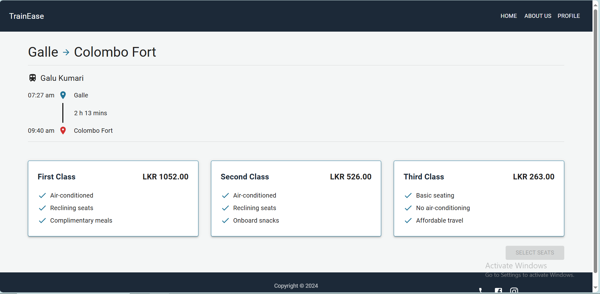
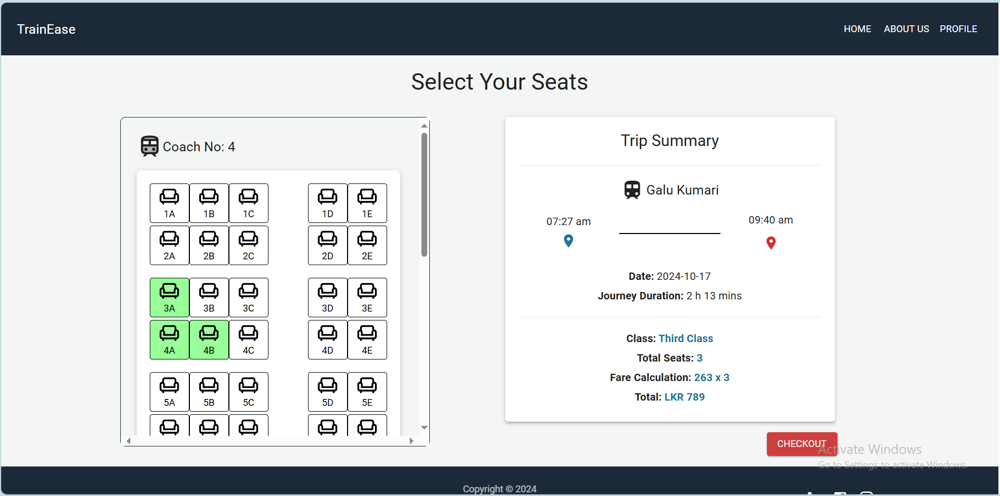
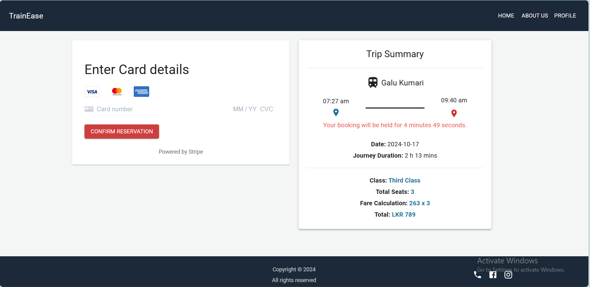

# Making a Booking

## Searching Trains

* Select starting station, destination station and date when it's need to make a booking.
* Click on ***Search*** button.

## Selecting a shedule
* Select a shedule according to the preference.

## Selecting a class

* Select a class according to the preference.

* Click on the ***Select Seats*** button.

## Selecting seats

* Select seats on the preference on seat layout. Fee is calculated according to the number of seats selected and **Trip Summary** is shown on right hand side.
* Click on ***Checkout*** button.

## Payment Process 

* Enter card details and confirm booking within 5 minutes of seat selection.

* An email will be sent for a successful booking with attached e-tickets.